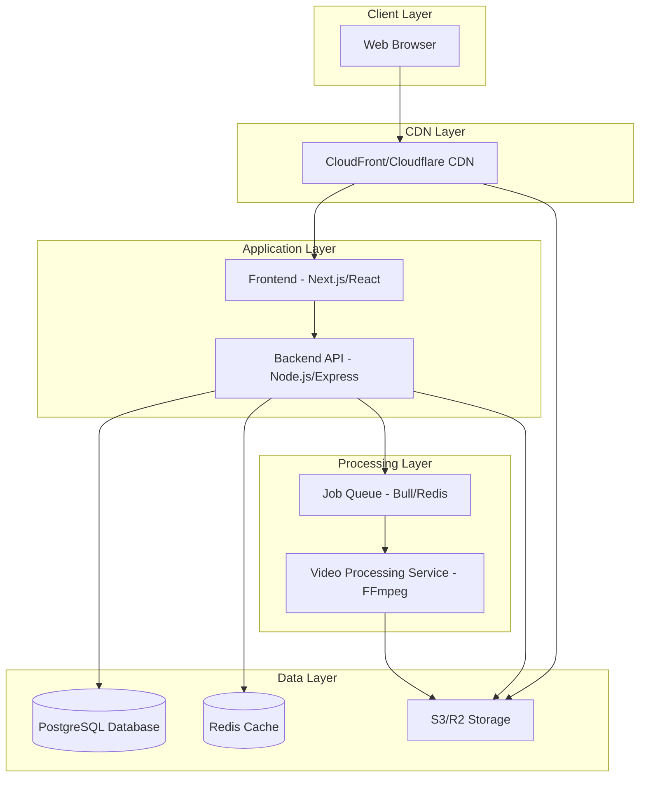

# Design Document - Video Platform

## Overview

The Video Platform is a full-stack web application that enables users to upload, manage, and view video content through personalized channels. The architecture follows a modern cloud-native approach with separate frontend, backend, and storage layers to ensure scalability, performance, and maintainability.

The platform will support video upload with automatic transcoding, channel management, video playback with adaptive streaming, and content discovery through search functionality.

## Architecture

### High-Level Architecture



### Technology Stack

**Frontend:**
- Framework: Next.js 14 (React-based with SSR/SSG capabilities)
- UI Library: React 18
- Styling: Tailwind CSS
- Video Player: Video.js with HLS.js plugin
- State Management: React Context API / Zustand
- HTTP Client: Axios

**Backend:**
- Runtime: Node.js 20 LTS
- Framework: Express.js
- Authentication: JWT (JSON Web Tokens) + bcrypt
- File Upload: Multer
- Video Processing: FFmpeg (via fluent-ffmpeg)
- Job Queue: Bull (Redis-based)

**Database:**
- Primary Database: PostgreSQL 15
- ORM: Prisma
- Caching: Redis 7

**Storage & CDN:**
- Object Storage: AWS S3 or Cloudflare R2
- CDN: AWS CloudFront or Cloudflare CDN
- Video Formats: HLS (HTTP Live Streaming) for adaptive bitrate

**Infrastructure:**
- Containerization: Docker
- Orchestration: Docker Compose (development) / Kubernetes (production)

## Components and Interfaces

### 1. Frontend Application

**Purpose:** Provides the user interface for all platform interactions

**Key Components:**

- **Video Player Component**
  - Uses Video.js with hls.js for adaptive streaming
  - Controls: play/pause, seek, volume, fullscreen, quality selector
  - Displays video metadata (title, views, upload date)
  
- **Upload Interface Component**
  - Drag-and-drop file upload
  - Progress bar with percentage
  - Form for title, description, and thumbnail
  - File validation (format, size)
  
- **Channel Page Component**
  - Channel header with avatar and name
  - Video grid layout
  - Channel information section
  
- **Search Component**
  - Search bar with autocomplete
  - Results display (videos and channels)
  - Filters and sorting options
  
- **Authentication Components**
  - Login form
  - Registration form
  - Protected route wrapper

**API Integration:**
- RESTful API calls to backend
- JWT token management in localStorage/cookies
- Multipart form data for file uploads

### 2. Backend API

**Purpose:** Handles business logic, data validation, and orchestrates services

**API Endpoints:**

```
Authentication:
POST   /api/auth/register          - Create new user account
POST   /api/auth/login             - Authenticate user
POST   /api/auth/logout            - Invalidate session
GET    /api/auth/me                - Get current user info

Users:
GET    /api/users/:id              - Get user profile
PUT    /api/users/:id              - Update user profile

Channels:
POST   /api/channels               - Create channel
GET    /api/channels/:id           - Get channel details
PUT    /api/channels/:id           - Update channel
GET    /api/channels/:id/videos    - Get channel videos
POST   /api/channels/:id/avatar    - Upload channel avatar

Videos:
POST   /api/videos                 - Upload video
GET    /api/videos/:id             - Get video details
PUT    /api/videos/:id             - Update video metadata
DELETE /api/videos/:id             - Delete video
GET    /api/videos/:id/stream      - Get video streaming URL
POST   /api/videos/:id/thumbnail   - Upload custom thumbnail
GET    /api/videos/search          - Search videos

Analytics:
POST   /api/videos/:id/view        - Record video view
GET    /api/videos/:id/stats       - Get video statistics
```

**Middleware:**
- Authentication middleware (JWT verification)
- Request validation middleware
- Error handling middleware
- Rate limiting middleware
- CORS configuration

### 3. Video Processing Service

**Purpose:** Transcodes uploaded videos into multiple formats and qualities

**Processing Pipeline:**

1. **Input Validation**
   - Verify file format (MP4, WebM, AVI)
   - Check file integrity
   - Extract metadata (duration, resolution, codec)

2. **Transcoding**
   - Generate multiple quality variants:
     - 1080p (1920x1080) @ 5000 kbps
     - 720p (1280x720) @ 2500 kbps
     - 480p (854x480) @ 1000 kbps
     - 360p (640x360) @ 500 kbps
   - Convert to H.264 codec
   - Generate HLS segments (.m3u8 playlist + .ts segments)

3. **Thumbnail Generation**
   - Extract frame at 1 second mark
   - Resize to 320x180 pixels
   - Save as JPEG

4. **Upload to Storage**
   - Upload all variants to S3/R2
   - Set appropriate cache headers
   - Generate CDN URLs

**FFmpeg Commands:**
```bash
# Transcode to 720p HLS
ffmpeg -i input.mp4 \
  -vf scale=1280:720 \
  -c:v libx264 -b:v 2500k \
  -c:a aac -b:a 128k \
  -hls_time 10 \
  -hls_playlist_type vod \
  -hls_segment_filename "720p_%03d.ts" \
  720p.m3u8

# Generate thumbnail
ffmpeg -i input.mp4 \
  -ss 00:00:01 \
  -vframes 1 \
  -vf scale=320:180 \
  thumbnail.jpg
```

### 4. Storage Service

**Purpose:** Manages file storage and retrieval

**Storage Structure:**
```
/videos/
  /{video_id}/
    /original/
      video.mp4
    /1080p/
      playlist.m3u8
      segment_000.ts
      segment_001.ts
      ...
    /720p/
      playlist.m3u8
      segment_000.ts
      ...
    /480p/
      ...
    /360p/
      ...
    /thumbnails/
      default.jpg
      custom.jpg

/avatars/
  /{channel_id}/
    avatar.jpg
```

**CDN Configuration:**
- Cache-Control headers for video segments (1 year)
- CORS headers for cross-origin requests
- Signed URLs for private content (future feature)

## Data Models

### User Model

```typescript
interface User {
  id: string;                    // UUID
  email: string;                 // Unique, validated
  passwordHash: string;          // bcrypt hashed
  createdAt: Date;
  updatedAt: Date;
  channel?: Channel;             // One-to-one relationship
}
```

### Channel Model

```typescript
interface Channel {
  id: string;                    // UUID
  userId: string;                // Foreign key to User
  name: string;                  // 3-50 characters
  avatarUrl?: string;            // S3/R2 URL
  description?: string;          // Optional, max 1000 chars
  createdAt: Date;
  updatedAt: Date;
  videos: Video[];               // One-to-many relationship
}
```

### Video Model

```typescript
interface Video {
  id: string;                    // UUID
  channelId: string;             // Foreign key to Channel
  title: string;                 // Max 100 characters
  description?: string;          // Max 5000 characters
  thumbnailUrl: string;          // S3/R2 URL
  duration: number;              // In seconds
  status: VideoStatus;           // UPLOADING, PROCESSING, READY, FAILED
  originalFileUrl: string;       // S3/R2 URL
  hlsPlaylistUrl: string;        // Master playlist URL
  viewCount: number;             // Default 0
  createdAt: Date;
  updatedAt: Date;
  variants: VideoVariant[];      // One-to-many relationship
}

enum VideoStatus {
  UPLOADING = 'UPLOADING',
  PROCESSING = 'PROCESSING',
  READY = 'READY',
  FAILED = 'FAILED'
}
```

### VideoVariant Model

```typescript
interface VideoVariant {
  id: string;                    // UUID
  videoId: string;               // Foreign key to Video
  quality: string;               // '1080p', '720p', '480p', '360p'
  resolution: string;            // '1920x1080', '1280x720', etc.
  bitrate: number;               // In kbps
  playlistUrl: string;           // HLS playlist URL
  createdAt: Date;
}
```

### Database Schema (PostgreSQL)

```sql
CREATE TABLE users (
  id UUID PRIMARY KEY DEFAULT gen_random_uuid(),
  email VARCHAR(255) UNIQUE NOT NULL,
  password_hash VARCHAR(255) NOT NULL,
  created_at TIMESTAMP DEFAULT CURRENT_TIMESTAMP,
  updated_at TIMESTAMP DEFAULT CURRENT_TIMESTAMP
);

CREATE TABLE channels (
  id UUID PRIMARY KEY DEFAULT gen_random_uuid(),
  user_id UUID UNIQUE NOT NULL REFERENCES users(id) ON DELETE CASCADE,
  name VARCHAR(50) NOT NULL,
  avatar_url TEXT,
  description TEXT,
  created_at TIMESTAMP DEFAULT CURRENT_TIMESTAMP,
  updated_at TIMESTAMP DEFAULT CURRENT_TIMESTAMP
);

CREATE TABLE videos (
  id UUID PRIMARY KEY DEFAULT gen_random_uuid(),
  channel_id UUID NOT NULL REFERENCES channels(id) ON DELETE CASCADE,
  title VARCHAR(100) NOT NULL,
  description TEXT,
  thumbnail_url TEXT NOT NULL,
  duration INTEGER NOT NULL,
  status VARCHAR(20) NOT NULL DEFAULT 'UPLOADING',
  original_file_url TEXT NOT NULL,
  hls_playlist_url TEXT,
  view_count INTEGER DEFAULT 0,
  created_at TIMESTAMP DEFAULT CURRENT_TIMESTAMP,
  updated_at TIMESTAMP DEFAULT CURRENT_TIMESTAMP
);

CREATE TABLE video_variants (
  id UUID PRIMARY KEY DEFAULT gen_random_uuid(),
  video_id UUID NOT NULL REFERENCES videos(id) ON DELETE CASCADE,
  quality VARCHAR(10) NOT NULL,
  resolution VARCHAR(20) NOT NULL,
  bitrate INTEGER NOT NULL,
  playlist_url TEXT NOT NULL,
  created_at TIMESTAMP DEFAULT CURRENT_TIMESTAMP
);

CREATE INDEX idx_videos_channel_id ON videos(channel_id);
CREATE INDEX idx_videos_status ON videos(status);
CREATE INDEX idx_videos_created_at ON videos(created_at DESC);
CREATE INDEX idx_channels_user_id ON channels(user_id);
```

## Error Handling

### Frontend Error Handling

**Upload Errors:**
- File too large: Display message "File size exceeds 2GB limit"
- Invalid format: Display message "Please upload MP4, WebM, or AVI files"
- Network error: Display retry button with message "Upload failed. Please try again"

**Playback Errors:**
- Video not found: Display "This video is no longer available"
- Streaming error: Attempt to switch to lower quality, show message if all fail
- Network timeout: Display "Connection lost. Retrying..."

**Authentication Errors:**
- Invalid credentials: Display "Invalid email or password"
- Session expired: Redirect to login with message "Your session has expired"
- Unauthorized access: Redirect to login

### Backend Error Handling

**Error Response Format:**
```typescript
interface ErrorResponse {
  error: {
    code: string;              // Machine-readable error code
    message: string;           // Human-readable message
    details?: any;             // Additional context
  }
}
```

**HTTP Status Codes:**
- 400 Bad Request: Invalid input data
- 401 Unauthorized: Missing or invalid authentication
- 403 Forbidden: Insufficient permissions
- 404 Not Found: Resource doesn't exist
- 409 Conflict: Resource already exists
- 413 Payload Too Large: File size exceeds limit
- 422 Unprocessable Entity: Validation errors
- 429 Too Many Requests: Rate limit exceeded
- 500 Internal Server Error: Unexpected server error
- 503 Service Unavailable: Service temporarily down

**Error Logging:**
- Log all errors with stack traces
- Include request context (user ID, endpoint, timestamp)
- Use structured logging (JSON format)
- Integrate with monitoring service (e.g., Sentry)

### Video Processing Error Handling

**Processing Failures:**
- Corrupted file: Mark video as FAILED, notify user
- Transcoding timeout: Retry up to 3 times, then mark as FAILED
- Storage upload failure: Retry with exponential backoff
- Insufficient resources: Queue job for retry when resources available

## Testing Strategy

### Unit Tests

**Backend:**
- Test all API endpoints with various inputs
- Test authentication middleware
- Test validation logic
- Test database models and queries
- Test video processing functions
- Coverage target: 80%

**Frontend:**
- Test React components in isolation
- Test form validation
- Test state management
- Test API integration layer
- Coverage target: 70%

### Integration Tests

- Test complete upload flow (frontend → backend → processing → storage)
- Test authentication flow (register → login → access protected routes)
- Test video playback flow (request → CDN → player)
- Test search functionality (query → database → results)

### End-to-End Tests

**Critical User Flows:**
1. User registration and channel creation
2. Video upload with metadata
3. Video playback on channel page
4. Search and discovery
5. Video management (edit, delete)

**Tools:**
- Playwright or Cypress for E2E tests
- Test against staging environment
- Run before each deployment

### Performance Tests

**Load Testing:**
- Simulate 1000 concurrent users
- Test video upload under load
- Test streaming performance
- Test database query performance

**Metrics to Monitor:**
- API response time (target: < 200ms for most endpoints)
- Video upload time (target: < 30s for 100MB file)
- Time to first byte for video streaming (target: < 1s)
- Database query time (target: < 50ms)

**Tools:**
- k6 or Artillery for load testing
- Lighthouse for frontend performance
- PostgreSQL EXPLAIN for query optimization

### Security Testing

- Test SQL injection vulnerabilities
- Test XSS vulnerabilities
- Test CSRF protection
- Test authentication bypass attempts
- Test file upload vulnerabilities (malicious files)
- Test rate limiting effectiveness

## Performance Optimization

### Frontend Optimization

- Code splitting with Next.js dynamic imports
- Image optimization with Next.js Image component
- Lazy loading for video thumbnails
- Debounce search input
- Implement virtual scrolling for long video lists
- Service worker for offline support (future)

### Backend Optimization

- Database connection pooling
- Redis caching for frequently accessed data:
  - Video metadata (TTL: 5 minutes)
  - Channel information (TTL: 10 minutes)
  - Search results (TTL: 1 minute)
- Database query optimization with indexes
- Pagination for list endpoints (default: 20 items per page)
- Rate limiting to prevent abuse

### Video Delivery Optimization

- Adaptive bitrate streaming (HLS)
- CDN edge caching
- Video preloading for next video in playlist
- Thumbnail sprite sheets for seek preview (future)

## Security Considerations

### Authentication & Authorization

- Passwords hashed with bcrypt (cost factor: 12)
- JWT tokens with 24-hour expiration
- Refresh token mechanism (future)
- HTTPS only in production
- Secure cookie flags (HttpOnly, Secure, SameSite)

### Input Validation

- Validate all user inputs on backend
- Sanitize HTML in descriptions
- File type validation (magic number check, not just extension)
- File size limits enforced
- SQL injection prevention via parameterized queries (Prisma ORM)

### File Upload Security

- Scan uploaded files for malware (future with ClamAV)
- Restrict file types to video formats only
- Generate random filenames to prevent path traversal
- Store files outside web root
- Implement upload rate limiting per user

### API Security

- CORS configuration for allowed origins
- Rate limiting (100 requests per 15 minutes per IP)
- Request size limits
- API versioning for backward compatibility
- Input sanitization and validation

## Deployment Architecture

### Development Environment

```yaml
# docker-compose.yml
services:
  frontend:
    build: ./frontend
    ports:
      - "3000:3000"
    environment:
      - NEXT_PUBLIC_API_URL=http://localhost:4000
  
  backend:
    build: ./backend
    ports:
      - "4000:4000"
    environment:
      - DATABASE_URL=postgresql://user:pass@db:5432/videodb
      - REDIS_URL=redis://redis:6379
      - S3_BUCKET=dev-videos
  
  db:
    image: postgres:15
    volumes:
      - postgres_data:/var/lib/postgresql/data
  
  redis:
    image: redis:7
  
  worker:
    build: ./backend
    command: npm run worker
    environment:
      - REDIS_URL=redis://redis:6379
```

### Production Environment

**Infrastructure:**
- Frontend: Vercel or AWS Amplify (Next.js hosting)
- Backend: AWS ECS or DigitalOcean App Platform
- Database: AWS RDS PostgreSQL or managed PostgreSQL
- Cache: AWS ElastiCache Redis or managed Redis
- Storage: AWS S3 or Cloudflare R2
- CDN: AWS CloudFront or Cloudflare CDN
- Worker: Separate container/service for video processing

**Scaling Strategy:**
- Horizontal scaling for backend API (load balancer)
- Separate worker pool for video processing
- Database read replicas for read-heavy operations
- CDN for global content delivery
- Auto-scaling based on CPU/memory metrics

## Future Enhancements

1. **Social Features**
   - Comments on videos
   - Likes and dislikes
   - Channel subscriptions
   - Notifications

2. **Advanced Features**
   - Live streaming support
   - Video playlists
   - Watch history
   - Recommendations algorithm
   - Video analytics dashboard

3. **Monetization**
   - Ad integration (Google Ad Manager)
   - Channel memberships
   - Super chat/donations
   - Analytics integration (Google Analytics, Mixpanel)

4. **Content Moderation**
   - Automated content scanning
   - Report system
   - Admin moderation panel
   - Copyright detection

5. **Mobile Applications**
   - iOS app (React Native)
   - Android app (React Native)
   - Push notifications
